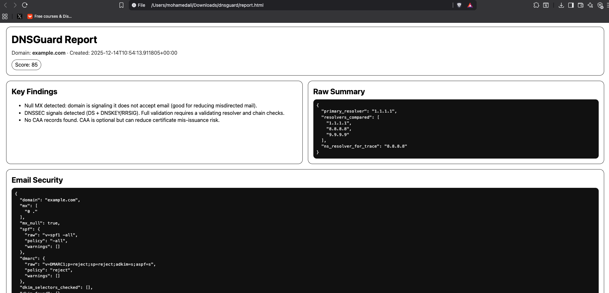

# DNSGuard — DNS Resolution + Security Posture Analyzer (Lookup • Trace • Reports)

DNSGuard is a reproducible DNS engineering + security posture tool built to (1) observe real DNS resolution behavior across resolvers and (2) highlight security-relevant DNS configuration signals (email spoofing resistance, DNS integrity signals, certificate issuance constraints).

It provides:
- **Multi-resolver DNS lookup** (Cloudflare/Google/Quad9) with timing + TTL
- **Iterative DNS trace** (root → TLD → authoritative) similar to `dig +trace`
- **Email security posture** checks (SPF / DMARC + optional DKIM selector checks)
- **DNSSEC signals** checks (DS/DNSKEY presence where available)
- **CAA** record checks
- **Safe risk indicators** (dangling CNAME indicator) without exploitation
- **Report generation** in **JSON + HTML** for evidence and reproducibility

---

## Why this matters

DNS is part of the Internet trust layer. Weak or missing DNS policies can increase risk of:
- **Email spoofing/phishing** (missing or weak SPF/DMARC/DKIM)
- **Integrity gaps** (no DNSSEC signals)
- **Certificate mis-issuance risk** (CAA not used to restrict certificate authorities)
- **Operational inconsistency** across resolvers (different answers, TTL behavior, latency)

DNSGuard is designed to make these behaviors *observable* and *reproducible* through structured outputs.

---

## Quick start

### Install (editable)
```bash
python3 -m venv .venv
source .venv/bin/activate
python -m pip install -U pip
python -m pip install -e ".[dev]"

dnsguard --version

(.venv) mohamedali@Mohameds-MacBook-Air dnsguard % dnsguard trace example.com --type A --ns-resolver 8.8.8.8

[1] server=198.41.0.4 q=example.com. A rcode=NOERROR 136ms answers=0 authority=13 additional=26
  authority:
     l.gtld-servers.net.
     j.gtld-servers.net.
     h.gtld-servers.net.
     d.gtld-servers.net.
     b.gtld-servers.net.
     f.gtld-servers.net.
     k.gtld-servers.net.
     m.gtld-servers.net.
     i.gtld-servers.net.
     g.gtld-servers.net.
     a.gtld-servers.net.
     c.gtld-servers.net.
[2] server=192.41.162.30 q=example.com. A rcode=NOERROR 130ms answers=0 authority=2 additional=0
  authority:
     a.iana-servers.net.
     b.iana-servers.net.
[3] server=199.43.135.53 q=example.com. A rcode=NOERROR 136ms answers=6 authority=0 additional=0
  answers:
     23.192.228.80
     23.192.228.84
     23.215.0.136
     23.215.0.138
     23.220.75.232
     23.220.75.245

FINAL:
   23.192.228.80
   23.192.228.84
   23.215.0.136
   23.215.0.138
   23.220.75.232
   23.220.75.245

(.venv) mohamedali@Mohameds-MacBook-Air dnsguard % dnsguard scan example.com --trace --ns-resolver 8.8.8.8 --out report.json --html report.html
(.venv) mohamedali@Mohameds-MacBook-Air dnsguard % open report.html


